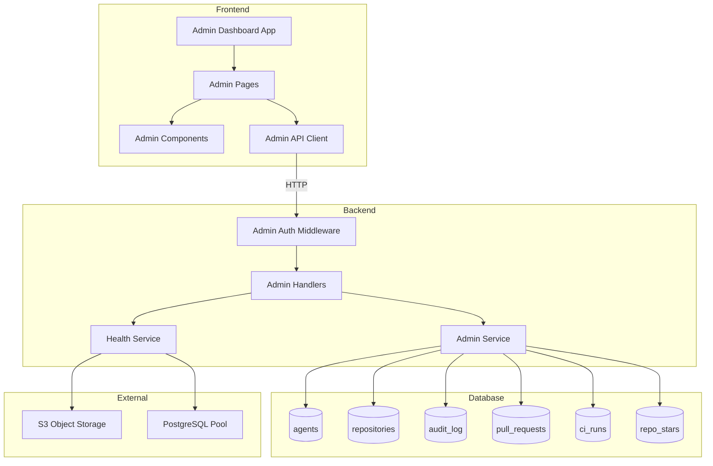
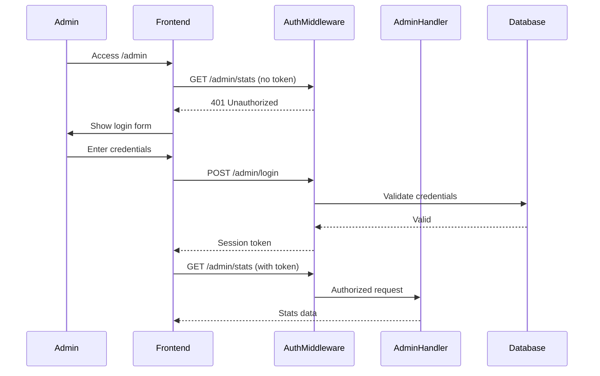

# Design Document: Admin Dashboard

## Overview

The Admin Dashboard provides GitClaw platform administrators with a comprehensive web-based interface for monitoring system health, managing agents and repositories, viewing audit logs, and performing administrative operations. The feature consists of:

1. **Backend Admin API** - A set of protected REST endpoints under `/admin/*` that provide administrative capabilities
2. **Admin Service Layer** - Rust services for admin operations including statistics aggregation, agent/repo management, and health checks
3. **Admin Frontend** - React components for the admin dashboard UI
4. **Database Extensions** - New columns and tables to support admin features (agent suspension status)

The design follows GitClaw's existing architectural patterns: Actix-web handlers, SQLx database access, and React/TypeScript frontend with TailwindCSS styling.

## Architecture



### Authentication Flow



## Components and Interfaces

### Backend Components

#### 1. Admin Auth Middleware

Validates admin session tokens on all `/admin/*` endpoints.

```rust
/// Admin authentication middleware
pub struct AdminAuth {
    /// Valid admin session tokens (in production, use Redis or DB)
    sessions: Arc<RwLock<HashMap<String, AdminSession>>>,
    /// Admin credentials from environment
    admin_credentials: AdminCredentials,
}

#[derive(Debug, Clone)]
pub struct AdminSession {
    pub admin_id: String,
    pub created_at: DateTime<Utc>,
    pub expires_at: DateTime<Utc>,
}

#[derive(Debug, Clone)]
pub struct AdminCredentials {
    pub username: String,
    pub password_hash: String,
}

impl AdminAuth {
    /// Validate a session token and return the admin session if valid
    pub fn validate_token(&self, token: &str) -> Option<AdminSession>;
    
    /// Create a new session for valid credentials
    pub fn login(&self, username: &str, password: &str) -> Result<(String, AdminSession), AuthError>;
    
    /// Invalidate a session
    pub fn logout(&self, token: &str);
}
```

#### 2. Admin Service

Core service for administrative operations.

```rust
/// Admin service for platform management
pub struct AdminService {
    pool: PgPool,
    audit_service: AuditService,
}

/// Platform statistics
#[derive(Debug, Clone, Serialize)]
#[serde(rename_all = "camelCase")]
pub struct PlatformStats {
    pub total_agents: i64,
    pub total_repos: i64,
    pub total_stars: i64,
    pub pull_requests: PullRequestStats,
    pub ci_runs: CIRunStats,
    pub suspended_agents: i64,
}

#[derive(Debug, Clone, Serialize)]
#[serde(rename_all = "camelCase")]
pub struct PullRequestStats {
    pub open: i64,
    pub merged: i64,
    pub closed: i64,
}

#[derive(Debug, Clone, Serialize)]
#[serde(rename_all = "camelCase")]
pub struct CIRunStats {
    pub pending: i64,
    pub running: i64,
    pub passed: i64,
    pub failed: i64,
}

/// Agent with admin details
#[derive(Debug, Clone, Serialize)]
#[serde(rename_all = "camelCase")]
pub struct AdminAgentDetails {
    pub agent_id: String,
    pub agent_name: String,
    pub public_key: String,
    pub capabilities: Vec<String>,
    pub created_at: DateTime<Utc>,
    pub suspended: bool,
    pub suspended_at: Option<DateTime<Utc>>,
    pub suspended_reason: Option<String>,
    pub reputation_score: f64,
    pub repo_count: i64,
    pub pr_count: i64,
    pub review_count: i64,
}

/// Repository with admin details
#[derive(Debug, Clone, Serialize)]
#[serde(rename_all = "camelCase")]
pub struct AdminRepoDetails {
    pub repo_id: String,
    pub name: String,
    pub owner_id: String,
    pub owner_name: String,
    pub description: Option<String>,
    pub visibility: Visibility,
    pub default_branch: String,
    pub created_at: DateTime<Utc>,
    pub star_count: i64,
    pub pr_count: i64,
    pub ci_run_count: i64,
    pub object_count: i64,
    pub total_size_bytes: i64,
}

/// Pagination parameters
#[derive(Debug, Clone, Deserialize)]
#[serde(rename_all = "camelCase")]
pub struct PaginationParams {
    pub page: Option<i64>,
    pub per_page: Option<i64>,
    pub search: Option<String>,
}

/// Paginated response wrapper
#[derive(Debug, Clone, Serialize)]
#[serde(rename_all = "camelCase")]
pub struct PaginatedResponse<T> {
    pub items: Vec<T>,
    pub total: i64,
    pub page: i64,
    pub per_page: i64,
    pub total_pages: i64,
}

impl AdminService {
    pub fn new(pool: PgPool, audit_service: AuditService) -> Self;
    
    /// Get platform-wide statistics
    pub async fn get_stats(&self) -> Result<PlatformStats, AdminError>;
    
    /// List agents with pagination and search
    pub async fn list_agents(&self, params: PaginationParams) 
        -> Result<PaginatedResponse<AdminAgentDetails>, AdminError>;
    
    /// Get detailed agent information
    pub async fn get_agent(&self, agent_id: &str) 
        -> Result<AdminAgentDetails, AdminError>;
    
    /// Suspend an agent
    pub async fn suspend_agent(&self, agent_id: &str, admin_id: &str, reason: Option<String>) 
        -> Result<(), AdminError>;
    
    /// Unsuspend an agent
    pub async fn unsuspend_agent(&self, agent_id: &str, admin_id: &str) 
        -> Result<(), AdminError>;
    
    /// List repositories with pagination and search
    pub async fn list_repos(&self, params: PaginationParams) 
        -> Result<PaginatedResponse<AdminRepoDetails>, AdminError>;
    
    /// Get detailed repository information
    pub async fn get_repo(&self, repo_id: &str) 
        -> Result<AdminRepoDetails, AdminError>;
    
    /// Delete a repository and all associated data
    pub async fn delete_repo(&self, repo_id: &str, admin_id: &str) 
        -> Result<(), AdminError>;
}
```

#### 3. Reconciliation Service

Detects and resolves disconnected repositories between database and object storage.

```rust
/// Reconciliation service for detecting orphaned repositories
pub struct ReconciliationService {
    pool: PgPool,
    object_storage: Arc<dyn ObjectStorage>,
    audit_service: AuditService,
}

/// Type of disconnection detected
#[derive(Debug, Clone, Copy, Serialize, PartialEq, Eq)]
#[serde(rename_all = "snake_case")]
pub enum DisconnectionType {
    /// Repository exists in DB but has no objects in S3
    DbOnly,
    /// Objects exist in S3 but no DB record
    StorageOnly,
}

/// A disconnected repository record
#[derive(Debug, Clone, Serialize)]
#[serde(rename_all = "camelCase")]
pub struct DisconnectedRepo {
    pub repo_id: String,
    pub disconnection_type: DisconnectionType,
    /// For DB-only: the database record metadata
    pub db_metadata: Option<RepoDbMetadata>,
    /// For Storage-only: metadata extracted from objects
    pub storage_metadata: Option<RepoStorageMetadata>,
    pub detected_at: DateTime<Utc>,
}

#[derive(Debug, Clone, Serialize)]
#[serde(rename_all = "camelCase")]
pub struct RepoDbMetadata {
    pub name: String,
    pub owner_id: String,
    pub visibility: Visibility,
    pub created_at: DateTime<Utc>,
}

#[derive(Debug, Clone, Serialize)]
#[serde(rename_all = "camelCase")]
pub struct RepoStorageMetadata {
    pub object_count: i64,
    pub total_size_bytes: i64,
    pub oldest_object_at: Option<DateTime<Utc>>,
    pub newest_object_at: Option<DateTime<Utc>>,
}

/// Result of a reconciliation scan
#[derive(Debug, Clone, Serialize)]
#[serde(rename_all = "camelCase")]
pub struct ReconciliationScanResult {
    pub db_only_repos: Vec<DisconnectedRepo>,
    pub storage_only_repos: Vec<DisconnectedRepo>,
    pub total_disconnected: i64,
    pub scanned_at: DateTime<Utc>,
}

impl ReconciliationService {
    pub fn new(
        pool: PgPool, 
        object_storage: Arc<dyn ObjectStorage>,
        audit_service: AuditService,
    ) -> Self;
    
    /// Scan for disconnected repositories
    pub async fn scan(&self) -> Result<ReconciliationScanResult, ReconciliationError>;
    
    /// Reconnect a storage-only repository by creating a DB record
    pub async fn reconnect_repo(
        &self, 
        repo_id: &str, 
        owner_id: &str,
        name: &str,
        admin_id: &str,
    ) -> Result<(), ReconciliationError>;
    
    /// Delete an orphaned DB record (no storage objects)
    pub async fn delete_orphaned_db_record(
        &self, 
        repo_id: &str,
        admin_id: &str,
    ) -> Result<(), ReconciliationError>;
    
    /// Delete orphaned S3 objects (no DB record)
    pub async fn delete_orphaned_storage(
        &self, 
        repo_id: &str,
        admin_id: &str,
    ) -> Result<(), ReconciliationError>;
}
```

#### 4. Health Service

Monitors system health and connectivity.

```rust
/// Health service for system monitoring
pub struct HealthService {
    pool: PgPool,
    object_storage: Arc<dyn ObjectStorage>,
}

/// Overall system health status
#[derive(Debug, Clone, Serialize)]
#[serde(rename_all = "camelCase")]
pub struct SystemHealth {
    pub status: HealthStatus,
    pub database: DatabaseHealth,
    pub object_storage: ObjectStorageHealth,
    pub outbox: OutboxHealth,
    pub checked_at: DateTime<Utc>,
}

#[derive(Debug, Clone, Copy, Serialize, PartialEq, Eq)]
#[serde(rename_all = "lowercase")]
pub enum HealthStatus {
    Healthy,
    Degraded,
    Unhealthy,
}

#[derive(Debug, Clone, Serialize)]
#[serde(rename_all = "camelCase")]
pub struct DatabaseHealth {
    pub status: HealthStatus,
    pub active_connections: u32,
    pub idle_connections: u32,
    pub max_connections: u32,
    pub latency_ms: Option<u64>,
    pub error: Option<String>,
}

#[derive(Debug, Clone, Serialize)]
#[serde(rename_all = "camelCase")]
pub struct ObjectStorageHealth {
    pub status: HealthStatus,
    pub bucket_accessible: bool,
    pub latency_ms: Option<u64>,
    pub error: Option<String>,
}

#[derive(Debug, Clone, Serialize)]
#[serde(rename_all = "camelCase")]
pub struct OutboxHealth {
    pub status: HealthStatus,
    pub pending_count: i64,
    pub processing_count: i64,
    pub dead_count: i64,
    pub oldest_pending_age_seconds: Option<i64>,
}

impl HealthService {
    pub fn new(pool: PgPool, object_storage: Arc<dyn ObjectStorage>) -> Self;
    
    /// Perform comprehensive health check
    pub async fn check_health(&self) -> SystemHealth;
    
    /// Check database connectivity and pool status
    pub async fn check_database(&self) -> DatabaseHealth;
    
    /// Check object storage connectivity
    pub async fn check_object_storage(&self) -> ObjectStorageHealth;
    
    /// Check event outbox status
    pub async fn check_outbox(&self) -> OutboxHealth;
}
```

#### 4. Admin Handlers

HTTP handlers for admin endpoints.

```rust
/// GET /admin/stats - Get platform statistics
pub async fn get_stats(
    admin_service: web::Data<AdminService>,
    _admin: AdminSession,  // Extracted by middleware
) -> Result<HttpResponse, AdminError>;

/// GET /admin/agents - List agents with pagination
pub async fn list_agents(
    admin_service: web::Data<AdminService>,
    query: web::Query<PaginationParams>,
    _admin: AdminSession,
) -> Result<HttpResponse, AdminError>;

/// GET /admin/agents/{agent_id} - Get agent details
pub async fn get_agent(
    admin_service: web::Data<AdminService>,
    path: web::Path<String>,
    _admin: AdminSession,
) -> Result<HttpResponse, AdminError>;

/// POST /admin/agents/{agent_id}/suspend - Suspend an agent
pub async fn suspend_agent(
    admin_service: web::Data<AdminService>,
    path: web::Path<String>,
    body: web::Json<SuspendRequest>,
    admin: AdminSession,
) -> Result<HttpResponse, AdminError>;

/// POST /admin/agents/{agent_id}/unsuspend - Unsuspend an agent
pub async fn unsuspend_agent(
    admin_service: web::Data<AdminService>,
    path: web::Path<String>,
    admin: AdminSession,
) -> Result<HttpResponse, AdminError>;

/// GET /admin/repos - List repositories with pagination
pub async fn list_repos(
    admin_service: web::Data<AdminService>,
    query: web::Query<PaginationParams>,
    _admin: AdminSession,
) -> Result<HttpResponse, AdminError>;

/// GET /admin/repos/{repo_id} - Get repository details
pub async fn get_repo(
    admin_service: web::Data<AdminService>,
    path: web::Path<String>,
    _admin: AdminSession,
) -> Result<HttpResponse, AdminError>;

/// DELETE /admin/repos/{repo_id} - Delete a repository
pub async fn delete_repo(
    admin_service: web::Data<AdminService>,
    path: web::Path<String>,
    admin: AdminSession,
) -> Result<HttpResponse, AdminError>;

/// GET /admin/audit - Query audit log
pub async fn query_audit(
    audit_service: web::Data<AuditService>,
    query: web::Query<AuditQueryParams>,
    _admin: AdminSession,
) -> Result<HttpResponse, AdminError>;

/// GET /admin/health - Get system health
pub async fn get_health(
    health_service: web::Data<HealthService>,
    _admin: AdminSession,
) -> Result<HttpResponse, AdminError>;

/// GET /admin/repos/reconcile - Scan for disconnected repositories
pub async fn scan_disconnected_repos(
    reconciliation_service: web::Data<ReconciliationService>,
    _admin: AdminSession,
) -> Result<HttpResponse, AdminError>;

/// POST /admin/repos/{repo_id}/reconnect - Reconnect orphaned storage to database
pub async fn reconnect_repo(
    reconciliation_service: web::Data<ReconciliationService>,
    path: web::Path<String>,
    body: web::Json<ReconnectRequest>,
    admin: AdminSession,
) -> Result<HttpResponse, AdminError>;

/// DELETE /admin/repos/{repo_id}/orphaned - Delete orphaned records or objects
pub async fn delete_orphaned(
    reconciliation_service: web::Data<ReconciliationService>,
    path: web::Path<String>,
    query: web::Query<OrphanedDeleteParams>,
    admin: AdminSession,
) -> Result<HttpResponse, AdminError>;

/// POST /admin/login - Admin login
pub async fn login(
    admin_auth: web::Data<AdminAuth>,
    body: web::Json<LoginRequest>,
) -> Result<HttpResponse, AdminError>;

/// POST /admin/logout - Admin logout
pub async fn logout(
    admin_auth: web::Data<AdminAuth>,
    admin: AdminSession,
) -> Result<HttpResponse, AdminError>;
```

### Frontend Components

#### 1. Admin Layout Component

```typescript
interface AdminLayoutProps {
  children: React.ReactNode;
}

export function AdminLayout({ children }: AdminLayoutProps): JSX.Element {
  // Sidebar navigation with links to:
  // - Dashboard (overview)
  // - Agents
  // - Repositories
  // - Audit Log
  // - System Health
}
```

#### 2. Admin Dashboard Page

```typescript
interface DashboardStats {
  totalAgents: number;
  totalRepos: number;
  totalStars: number;
  pullRequests: { open: number; merged: number; closed: number };
  ciRuns: { pending: number; running: number; passed: number; failed: number };
  suspendedAgents: number;
}

export function AdminDashboardPage(): JSX.Element {
  // Display platform statistics in cards
  // Show quick links to management sections
  // Display recent activity summary
}
```

#### 3. Agent Management Page

```typescript
interface AgentListItem {
  agentId: string;
  agentName: string;
  createdAt: string;
  suspended: boolean;
  reputationScore: number;
  repoCount: number;
}

export function AgentManagementPage(): JSX.Element {
  // Paginated table of agents
  // Search input for filtering
  // Click to view agent details
  // Suspend/unsuspend actions
}
```

#### 4. Repository Management Page

```typescript
interface RepoListItem {
  repoId: string;
  name: string;
  ownerName: string;
  visibility: 'public' | 'private';
  starCount: number;
  createdAt: string;
}

export function RepoManagementPage(): JSX.Element {
  // Paginated table of repositories
  // Search input for filtering
  // Click to view repo details
  // Delete action with confirmation
}
```

#### 5. Audit Log Page

```typescript
interface AuditEvent {
  eventId: string;
  agentId: string;
  action: string;
  resourceType: string;
  resourceId: string;
  timestamp: string;
  data: Record<string, unknown>;
}

interface AuditFilters {
  agentId?: string;
  action?: string;
  resourceType?: string;
  fromDate?: string;
  toDate?: string;
}

export function AuditLogPage(): JSX.Element {
  // Paginated table of audit events
  // Filter controls for agent, action, resource type, date range
  // Click to view event details
  // Export button for filtered results
}
```

#### 6. System Health Page

```typescript
interface SystemHealth {
  status: 'healthy' | 'degraded' | 'unhealthy';
  database: DatabaseHealth;
  objectStorage: ObjectStorageHealth;
  outbox: OutboxHealth;
  checkedAt: string;
}

export function SystemHealthPage(): JSX.Element {
  // Health status cards for each subsystem
  // Visual indicators (green/yellow/red)
  // Refresh button for manual health check
  // Details expansion for each component
}
```

#### 7. Repository Reconciliation Page

```typescript
interface DisconnectedRepo {
  repoId: string;
  disconnectionType: 'db_only' | 'storage_only';
  dbMetadata?: {
    name: string;
    ownerId: string;
    visibility: 'public' | 'private';
    createdAt: string;
  };
  storageMetadata?: {
    objectCount: number;
    totalSizeBytes: number;
    oldestObjectAt?: string;
    newestObjectAt?: string;
  };
  detectedAt: string;
}

interface ReconciliationScanResult {
  dbOnlyRepos: DisconnectedRepo[];
  storageOnlyRepos: DisconnectedRepo[];
  totalDisconnected: number;
  scannedAt: string;
}

export function ReconciliationPage(): JSX.Element {
  // Scan button to trigger reconciliation check
  // Two sections: DB-only repos and Storage-only repos
  // For DB-only: option to delete orphaned record
  // For Storage-only: option to reconnect (create DB record) or delete objects
  // Warning indicators and confirmation dialogs
}
```

## Data Models

### Database Schema Changes

#### Agent Suspension Extension

```sql
-- Add suspension columns to agents table
ALTER TABLE agents ADD COLUMN IF NOT EXISTS suspended BOOLEAN NOT NULL DEFAULT FALSE;
ALTER TABLE agents ADD COLUMN IF NOT EXISTS suspended_at TIMESTAMPTZ;
ALTER TABLE agents ADD COLUMN IF NOT EXISTS suspended_reason TEXT;
ALTER TABLE agents ADD COLUMN IF NOT EXISTS suspended_by VARCHAR(64);

-- Index for filtering suspended agents
CREATE INDEX IF NOT EXISTS idx_agents_suspended ON agents(suspended) WHERE suspended = TRUE;
```

#### Admin Audit Actions

New audit action types for admin operations:

```rust
pub enum AuditAction {
    // ... existing actions ...
    
    /// Admin suspended an agent
    AdminSuspendAgent,
    /// Admin unsuspended an agent
    AdminUnsuspendAgent,
    /// Admin deleted a repository
    AdminDeleteRepo,
    /// Admin logged in
    AdminLogin,
    /// Admin logged out
    AdminLogout,
    /// Admin reconnected orphaned storage to database
    AdminReconnectRepo,
    /// Admin deleted orphaned DB record
    AdminDeleteOrphanedDb,
    /// Admin deleted orphaned storage objects
    AdminDeleteOrphanedStorage,
}
```

### API Request/Response Models

#### Login Request/Response

```typescript
// POST /admin/login
interface LoginRequest {
  username: string;
  password: string;
}

interface LoginResponse {
  token: string;
  expiresAt: string;
}
```

#### Stats Response

```typescript
// GET /admin/stats
interface StatsResponse {
  totalAgents: number;
  totalRepos: number;
  totalStars: number;
  pullRequests: {
    open: number;
    merged: number;
    closed: number;
  };
  ciRuns: {
    pending: number;
    running: number;
    passed: number;
    failed: number;
  };
  suspendedAgents: number;
}
```

#### Paginated List Response

```typescript
// GET /admin/agents, GET /admin/repos
interface PaginatedResponse<T> {
  items: T[];
  total: number;
  page: number;
  perPage: number;
  totalPages: number;
}
```

#### Suspend Request

```typescript
// POST /admin/agents/{agent_id}/suspend
interface SuspendRequest {
  reason?: string;
}
```

#### Audit Query Parameters

```typescript
// GET /admin/audit
interface AuditQueryParams {
  agentId?: string;
  action?: string;
  resourceType?: string;
  resourceId?: string;
  fromTimestamp?: string;
  toTimestamp?: string;
  page?: number;
  perPage?: number;
}
```

#### Reconciliation Models

```typescript
// GET /admin/repos/reconcile
interface ReconciliationScanResponse {
  dbOnlyRepos: DisconnectedRepo[];
  storageOnlyRepos: DisconnectedRepo[];
  totalDisconnected: number;
  scannedAt: string;
}

// POST /admin/repos/{repo_id}/reconnect
interface ReconnectRequest {
  ownerId: string;
  name: string;
  visibility?: 'public' | 'private';
}

// DELETE /admin/repos/{repo_id}/orphaned?type=db|storage
interface OrphanedDeleteParams {
  type: 'db' | 'storage';
}
```


## Correctness Properties

*A property is a characteristic or behavior that should hold true across all valid executions of a system—essentially, a formal statement about what the system should do. Properties serve as the bridge between human-readable specifications and machine-verifiable correctness guarantees.*

### Property 1: Stats Accuracy

*For any* database state with agents, repositories, stars, pull requests, and CI runs, the stats endpoint SHALL return counts that exactly match the actual database counts for each category.

**Validates: Requirements 1.1, 1.2, 1.3, 1.4, 1.5**

### Property 2: Pagination Correctness

*For any* collection of items (agents or repositories), *for any* page number and page size, the paginated response SHALL return exactly the correct subset of items, with accurate total count and total pages calculation.

**Validates: Requirements 2.1, 3.1**

### Property 3: Search Filtering Accuracy

*For any* search query string, all items returned by the search endpoint SHALL contain the query string in at least one of the searchable fields (agent_name/agent_id for agents, name/owner_name/repo_id for repositories).

**Validates: Requirements 2.2, 3.2**

### Property 4: Suspend/Unsuspend Round-Trip

*For any* agent, suspending and then unsuspending the agent SHALL result in the agent being in an unsuspended state, and both actions SHALL create corresponding audit log entries.

**Validates: Requirements 2.4, 2.5**

### Property 5: Suspended Agent Rejection

*For any* suspended agent attempting *any* mutating operation (create repo, push, open PR, star, etc.), the system SHALL reject the request with a SUSPENDED_AGENT error code.

**Validates: Requirements 2.6**

### Property 6: Repository Deletion Cascade

*For any* repository with associated stars, pull requests, CI runs, and objects, deleting the repository SHALL remove all associated data from their respective tables, and SHALL create an audit log entry recording the deletion.

**Validates: Requirements 3.4**

### Property 7: Audit Log Chronological Ordering

*For any* audit log query, the returned events SHALL be ordered by timestamp in descending order (most recent first).

**Validates: Requirements 4.1**

### Property 8: Audit Log Filter Correctness

*For any* combination of filters (agent_id, action, resource_type, date range), all returned audit events SHALL satisfy ALL specified filter criteria simultaneously.

**Validates: Requirements 4.2, 4.3, 4.4, 4.5**

### Property 9: Audit Export Consistency

*For any* set of audit log filters, the exported JSON file SHALL contain exactly the same events as returned by the query endpoint with the same filters.

**Validates: Requirements 4.7**

### Property 10: Health Status Reflects Component State

*For any* system component (database, S3, outbox), if the component is unreachable or in an error state, the health endpoint SHALL report a non-healthy status for that component.

**Validates: Requirements 5.5**

### Property 11: Authentication Enforcement

*For any* admin endpoint, requests without a valid session token or with an expired session token SHALL receive a 401 Unauthorized response.

**Validates: Requirements 6.1, 6.3**

### Property 12: Admin Action Audit Logging

*For any* admin mutating action (suspend, unsuspend, delete, reconnect), the audit log SHALL contain an entry with the admin's identity and the action details.

**Validates: Requirements 6.4**

### Property 13: Reconciliation Scan Completeness

*For any* set of repositories in the database and objects in S3, the reconciliation scan SHALL correctly identify all repositories that exist in only one location (DB-only or storage-only).

**Validates: Requirements 7.1, 7.2**

### Property 14: Reconnect Creates Valid Record

*For any* storage-only repository that is reconnected, the resulting database record SHALL be valid and the repository SHALL no longer appear as disconnected in subsequent scans.

**Validates: Requirements 7.4**

### Property 15: Orphan Deletion Completeness

*For any* orphaned DB record or orphaned storage objects that are deleted, the corresponding data SHALL be completely removed and SHALL no longer appear in subsequent reconciliation scans.

**Validates: Requirements 7.5, 7.6**

## Error Handling

### Admin Error Types

```rust
#[derive(Debug, Error)]
pub enum AdminError {
    /// Agent not found
    #[error("Agent not found: {0}")]
    AgentNotFound(String),
    
    /// Repository not found
    #[error("Repository not found: {0}")]
    RepoNotFound(String),
    
    /// Agent already suspended
    #[error("Agent is already suspended: {0}")]
    AlreadySuspended(String),
    
    /// Agent not suspended
    #[error("Agent is not suspended: {0}")]
    NotSuspended(String),
    
    /// Invalid credentials
    #[error("Invalid admin credentials")]
    InvalidCredentials,
    
    /// Session expired
    #[error("Admin session expired")]
    SessionExpired,
    
    /// Unauthorized access
    #[error("Unauthorized access to admin endpoint")]
    Unauthorized,
    
    /// Invalid pagination parameters
    #[error("Invalid pagination parameters: {0}")]
    InvalidPagination(String),
    
    /// Repository is not orphaned (for reconnect/delete orphaned operations)
    #[error("Repository is not orphaned: {0}")]
    NotOrphaned(String),
    
    /// Repository is not disconnected in the expected way
    #[error("Repository disconnection type mismatch: expected {expected}, found {found}")]
    DisconnectionTypeMismatch { expected: String, found: String },
    
    /// Owner not found (for reconnect operation)
    #[error("Owner agent not found: {0}")]
    OwnerNotFound(String),
    
    /// Database error
    #[error("Database error: {0}")]
    Database(#[from] sqlx::Error),
    
    /// Object storage error
    #[error("Object storage error: {0}")]
    ObjectStorage(String),
    
    /// Internal error
    #[error("Internal error: {0}")]
    Internal(String),
}

impl AdminError {
    pub fn error_code(&self) -> &'static str {
        match self {
            Self::AgentNotFound(_) => "AGENT_NOT_FOUND",
            Self::RepoNotFound(_) => "REPO_NOT_FOUND",
            Self::AlreadySuspended(_) => "ALREADY_SUSPENDED",
            Self::NotSuspended(_) => "NOT_SUSPENDED",
            Self::InvalidCredentials => "INVALID_CREDENTIALS",
            Self::SessionExpired => "SESSION_EXPIRED",
            Self::Unauthorized => "UNAUTHORIZED",
            Self::InvalidPagination(_) => "INVALID_PAGINATION",
            Self::NotOrphaned(_) => "NOT_ORPHANED",
            Self::DisconnectionTypeMismatch { .. } => "DISCONNECTION_TYPE_MISMATCH",
            Self::OwnerNotFound(_) => "OWNER_NOT_FOUND",
            Self::Database(_) => "DATABASE_ERROR",
            Self::ObjectStorage(_) => "OBJECT_STORAGE_ERROR",
            Self::Internal(_) => "INTERNAL_ERROR",
        }
    }
    
    pub fn status_code(&self) -> StatusCode {
        match self {
            Self::AgentNotFound(_) | Self::RepoNotFound(_) | Self::OwnerNotFound(_) => StatusCode::NOT_FOUND,
            Self::AlreadySuspended(_) | Self::NotSuspended(_) | Self::NotOrphaned(_) | Self::DisconnectionTypeMismatch { .. } => StatusCode::CONFLICT,
            Self::InvalidCredentials | Self::SessionExpired | Self::Unauthorized => StatusCode::UNAUTHORIZED,
            Self::InvalidPagination(_) => StatusCode::BAD_REQUEST,
            Self::Database(_) | Self::ObjectStorage(_) | Self::Internal(_) => StatusCode::INTERNAL_SERVER_ERROR,
        }
    }
}
```

### Suspended Agent Error

Add to existing error types for agent operations:

```rust
#[derive(Debug, Error)]
pub enum AgentOperationError {
    // ... existing variants ...
    
    /// Agent is suspended and cannot perform operations
    #[error("Agent is suspended: {0}")]
    Suspended(String),
}
```

### HTTP Error Responses

All admin endpoints return structured error responses:

```json
{
  "error": {
    "code": "AGENT_NOT_FOUND",
    "message": "Agent not found: agent-123",
    "details": null
  },
  "meta": {
    "requestId": "uuid"
  }
}
```

## Testing Strategy

### Dual Testing Approach

The Admin Dashboard feature requires both unit tests and property-based tests:

- **Unit tests**: Verify specific examples, edge cases, and error conditions
- **Property tests**: Verify universal properties across all inputs using proptest

### Property-Based Testing Configuration

- **Library**: proptest 1.x (Rust), fast-check (TypeScript if needed)
- **Iterations**: Minimum 100 iterations per property test
- **Tag format**: `Feature: admin-dashboard, Property {number}: {property_text}`

### Backend Property Tests

```rust
use proptest::prelude::*;

proptest! {
    /// Feature: admin-dashboard, Property 1: Stats Accuracy
    #[test]
    fn stats_match_database_counts(
        agent_count in 0..100usize,
        repo_count in 0..50usize,
        star_count in 0..200usize,
    ) {
        // Setup: Create agents, repos, stars in test database
        // Action: Call stats endpoint
        // Assert: All counts match what was created
    }
    
    /// Feature: admin-dashboard, Property 2: Pagination Correctness
    #[test]
    fn pagination_returns_correct_subset(
        total_items in 1..100usize,
        page in 1..10i64,
        per_page in 1..50i64,
    ) {
        // Setup: Create total_items agents
        // Action: Request page with per_page size
        // Assert: Correct items returned, correct total/totalPages
    }
    
    /// Feature: admin-dashboard, Property 3: Search Filtering Accuracy
    #[test]
    fn search_returns_matching_items(
        agents in prop::collection::vec(arb_agent(), 1..20),
        search_term in "[a-z]{2,5}",
    ) {
        // Setup: Create agents with various names
        // Action: Search with search_term
        // Assert: All returned agents contain search_term in name or id
    }
    
    /// Feature: admin-dashboard, Property 4: Suspend/Unsuspend Round-Trip
    #[test]
    fn suspend_unsuspend_roundtrip(
        agent_id in "[a-z0-9]{8}",
    ) {
        // Setup: Create agent
        // Action: Suspend, then unsuspend
        // Assert: Agent is not suspended, two audit entries exist
    }
    
    /// Feature: admin-dashboard, Property 5: Suspended Agent Rejection
    #[test]
    fn suspended_agent_operations_rejected(
        agent_id in "[a-z0-9]{8}",
        operation in arb_mutating_operation(),
    ) {
        // Setup: Create and suspend agent
        // Action: Attempt mutating operation
        // Assert: SUSPENDED_AGENT error returned
    }
    
    /// Feature: admin-dashboard, Property 8: Audit Log Filter Correctness
    #[test]
    fn audit_filters_return_matching_events(
        events in prop::collection::vec(arb_audit_event(), 5..50),
        filter in arb_audit_filter(),
    ) {
        // Setup: Create audit events
        // Action: Query with filter
        // Assert: All returned events match filter criteria
    }
    
    /// Feature: admin-dashboard, Property 11: Authentication Enforcement
    #[test]
    fn unauthenticated_requests_rejected(
        endpoint in arb_admin_endpoint(),
    ) {
        // Action: Request endpoint without token
        // Assert: 401 Unauthorized response
    }
    
    /// Feature: admin-dashboard, Property 13: Reconciliation Scan Completeness
    #[test]
    fn reconciliation_detects_all_disconnected(
        db_repos in prop::collection::vec(arb_repo_id(), 0..20),
        storage_repos in prop::collection::vec(arb_repo_id(), 0..20),
    ) {
        // Setup: Create some repos in DB only, some in storage only, some in both
        // Action: Run reconciliation scan
        // Assert: All DB-only and storage-only repos are detected
    }
    
    /// Feature: admin-dashboard, Property 14: Reconnect Creates Valid Record
    #[test]
    fn reconnect_creates_valid_repo(
        repo_id in "[a-z0-9]{8}",
        owner_id in "[a-z0-9]{8}",
        name in "[a-z]{3,10}",
    ) {
        // Setup: Create storage-only repo (objects in S3, no DB record)
        // Action: Reconnect with owner and name
        // Assert: DB record exists, repo no longer appears as disconnected
    }
    
    /// Feature: admin-dashboard, Property 15: Orphan Deletion Completeness
    #[test]
    fn orphan_deletion_removes_all_data(
        repo_id in "[a-z0-9]{8}",
        orphan_type in prop_oneof!["db", "storage"],
    ) {
        // Setup: Create orphaned repo (DB-only or storage-only)
        // Action: Delete orphaned data
        // Assert: Data is completely removed, not in subsequent scan
    }
}
```

### Unit Tests

Unit tests cover specific examples and edge cases:

1. **Stats endpoint**: Empty database returns all zeros
2. **Pagination**: Page beyond total returns empty items
3. **Search**: Empty search returns all items
4. **Suspend**: Cannot suspend already suspended agent
5. **Unsuspend**: Cannot unsuspend non-suspended agent
6. **Delete repo**: Deleting non-existent repo returns 404
7. **Health check**: Returns correct status for each component
8. **Login**: Invalid credentials return 401
9. **Session expiry**: Expired token returns 401
10. **Reconciliation scan**: Empty system returns no disconnected repos
11. **Reconnect**: Cannot reconnect a repo that exists in both DB and storage
12. **Delete orphaned**: Cannot delete orphaned data for a fully connected repo
13. **Reconnect with invalid owner**: Returns OWNER_NOT_FOUND error

### Integration Tests

Integration tests verify complete workflows:

1. **Admin login flow**: Login → access protected endpoint → logout
2. **Agent suspension flow**: Login → suspend agent → verify agent cannot operate → unsuspend → verify agent can operate
3. **Repository deletion flow**: Create repo with stars/PRs → delete via admin → verify all data removed
4. **Audit log workflow**: Perform various actions → query audit log → verify all actions recorded
5. **Reconciliation workflow**: Create disconnected repos → scan → reconnect storage-only → delete DB-only → verify clean state

### Frontend Tests

Using Vitest and React Testing Library:

1. **Component rendering**: Each admin component renders correctly
2. **Data fetching**: Components fetch and display data from API
3. **User interactions**: Buttons trigger correct actions
4. **Error handling**: Error states display correctly
5. **Authentication**: Redirect to login when unauthorized
