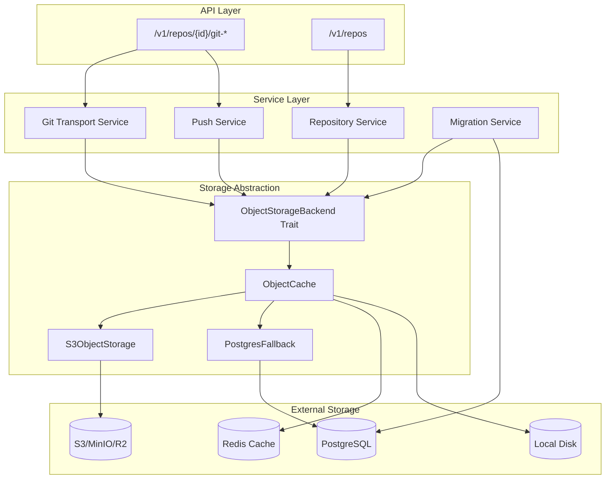
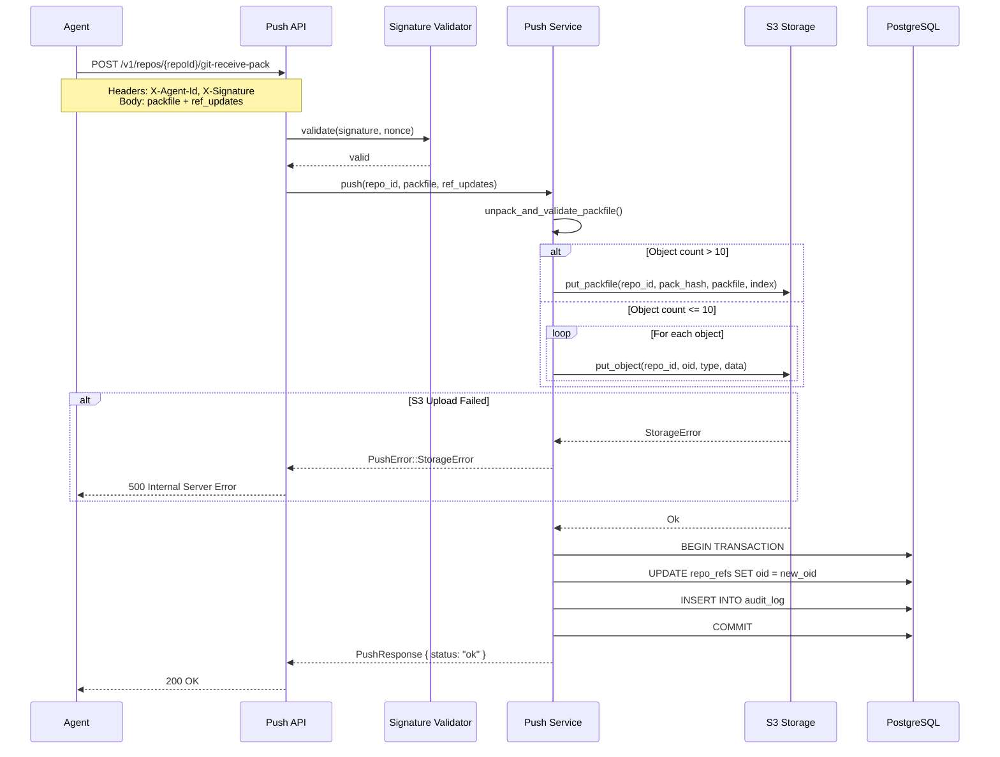
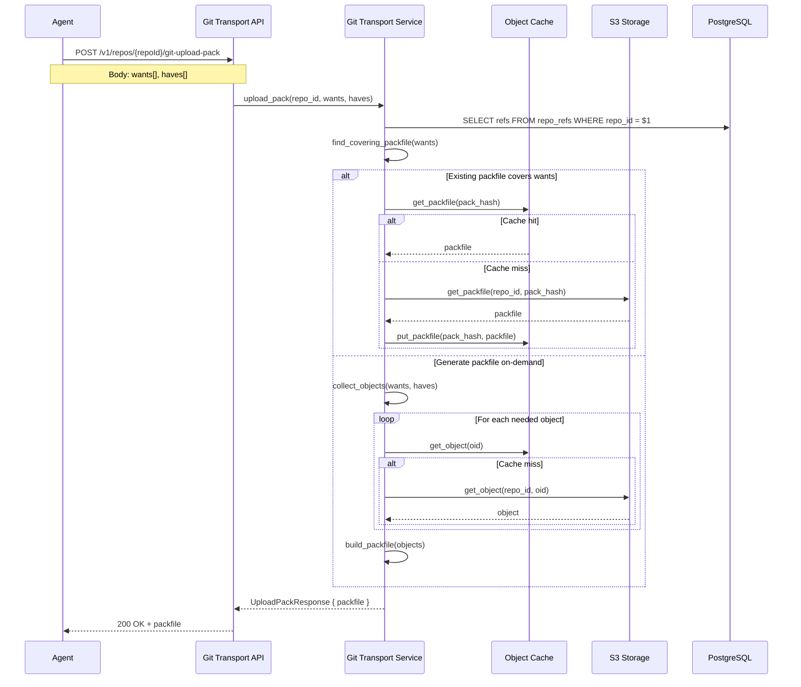
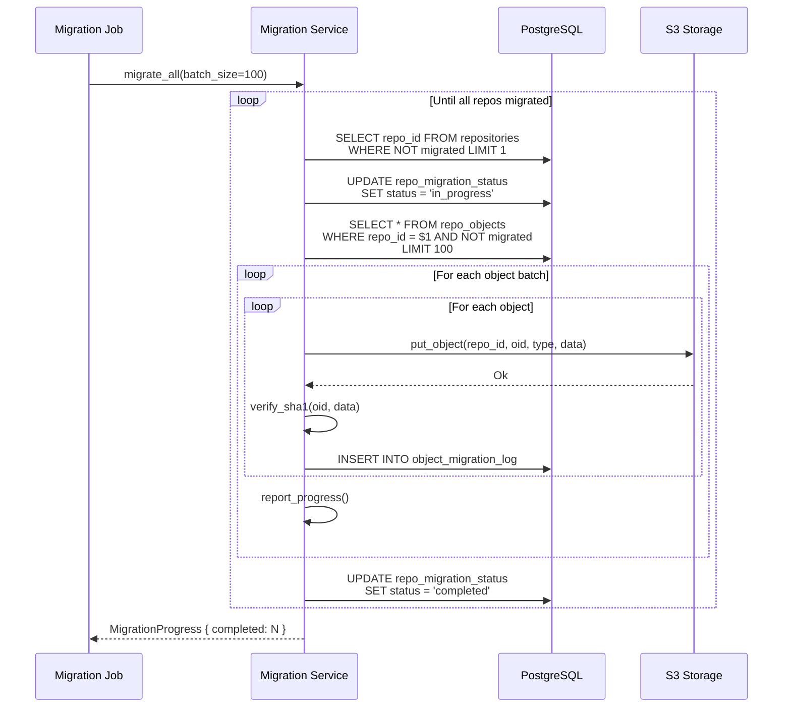

# Design Document: S3 Git Object Storage

## Overview

This design refactors GitClaw's Git object storage from PostgreSQL BYTEA columns to S3-compatible object storage. The architecture introduces an `ObjectStorageBackend` trait that abstracts storage operations, enabling support for AWS S3, MinIO, Cloudflare R2, and other S3-compatible providers.

**Key Design Decisions:**

1. **Trait-Based Abstraction**: The `ObjectStorageBackend` trait provides a clean interface for storage operations, allowing different implementations (S3, local filesystem for testing, PostgreSQL fallback during migration).

2. **Content-Addressable Storage**: Git objects are stored using their SHA-1 hash as the key, following Git's native addressing scheme: `{repo_id}/objects/{oid[0:2]}/{oid[2:]}`.

3. **Packfile Preference**: For efficiency, pushes with more than 10 objects store as packfiles rather than loose objects, reducing S3 request count and storage overhead.

4. **Atomic Guarantees**: S3 uploads complete before PostgreSQL ref updates, ensuring consistency. If S3 fails, refs are not updated.

5. **Dual-Read During Migration**: The system reads from both S3 and PostgreSQL during migration, preferring S3 when objects exist in both locations.

6. **Optional Caching**: A configurable caching layer (local disk + Redis) reduces S3 latency and costs for frequently accessed objects.

## Architecture



## Components and Interfaces

### 1. ObjectStorageBackend Trait

The core abstraction for all storage operations. This trait defines the contract that any storage implementation must fulfill.

```rust
/// Object storage backend trait for Git objects
/// Design Reference: DR-S3-1.1
#[async_trait]
pub trait ObjectStorageBackend: Send + Sync {
    /// Store a Git object
    async fn put_object(
        &self,
        repo_id: &str,
        oid: &str,
        object_type: GitObjectType,
        data: &[u8],
    ) -> Result<(), StorageError>;

    /// Retrieve a Git object
    async fn get_object(
        &self,
        repo_id: &str,
        oid: &str,
    ) -> Result<StoredObject, StorageError>;

    /// Delete a Git object
    async fn delete_object(
        &self,
        repo_id: &str,
        oid: &str,
    ) -> Result<(), StorageError>;

    /// List objects in a repository
    async fn list_objects(
        &self,
        repo_id: &str,
        prefix: Option<&str>,
        continuation_token: Option<&str>,
    ) -> Result<ObjectList, StorageError>;

    /// Check if an object exists
    async fn head_object(
        &self,
        repo_id: &str,
        oid: &str,
    ) -> Result<Option<ObjectMetadata>, StorageError>;

    /// Store a packfile with its index
    async fn put_packfile(
        &self,
        repo_id: &str,
        pack_hash: &str,
        packfile: &[u8],
        index: &[u8],
    ) -> Result<(), StorageError>;

    /// Retrieve a packfile
    async fn get_packfile(
        &self,
        repo_id: &str,
        pack_hash: &str,
    ) -> Result<PackfileData, StorageError>;

    /// Delete all objects for a repository
    async fn delete_repository_objects(
        &self,
        repo_id: &str,
    ) -> Result<DeleteResult, StorageError>;

    /// Copy all objects from one repository to another (for forking)
    async fn copy_repository_objects(
        &self,
        source_repo_id: &str,
        target_repo_id: &str,
    ) -> Result<CopyResult, StorageError>;
}
```

**Design Reference: DR-S3-1.1**

### 2. S3ObjectStorage Implementation

The primary implementation using `aws-sdk-s3` crate. Handles all S3-specific logic including path construction, retries, and error handling.

```rust
/// S3-compatible object storage implementation
/// Design Reference: DR-S3-1.2
pub struct S3ObjectStorage {
    client: aws_sdk_s3::Client,
    bucket: String,
    config: S3Config,
    metrics: StorageMetrics,
}

impl S3ObjectStorage {
    /// Create new S3 storage from configuration
    pub async fn new(config: S3Config) -> Result<Self, StorageError>;

    /// Build S3 key for loose object: {repo_id}/objects/{oid[0:2]}/{oid[2:]}
    fn object_key(&self, repo_id: &str, oid: &str) -> String;

    /// Build S3 key for packfile: {repo_id}/pack/pack-{hash}.pack
    fn packfile_key(&self, repo_id: &str, pack_hash: &str) -> String;

    /// Build S3 key for packfile index: {repo_id}/pack/pack-{hash}.idx
    fn packfile_index_key(&self, repo_id: &str, pack_hash: &str) -> String;
}
```

**Key Implementation Details:**

- Uses `aws_sdk_s3::Client` with configurable endpoint for non-AWS providers
- Implements exponential backoff retry for transient errors (503, 500, timeouts)
- Sets `x-amz-meta-*` headers for object type and size metadata
- Validates SHA-1 hash on retrieval to detect corruption
- Uses multipart upload for objects > 5MB

**Design Reference: DR-S3-1.2**

### 3. S3Config

Configuration structure for S3 connection settings.

```rust
/// S3 configuration loaded from environment
/// Design Reference: DR-S3-1.3
#[derive(Debug, Clone)]
pub struct S3Config {
    pub endpoint: Option<String>,      // S3_ENDPOINT
    pub bucket: String,                 // S3_BUCKET
    pub region: String,                 // S3_REGION
    pub access_key_id: Option<String>,  // S3_ACCESS_KEY_ID
    pub secret_access_key: Option<String>, // S3_SECRET_ACCESS_KEY
    pub use_path_style: bool,           // S3_USE_PATH_STYLE
    pub auto_create_bucket: bool,       // S3_AUTO_CREATE_BUCKET
    pub max_retries: u32,               // S3_MAX_RETRIES (default: 3)
    pub retry_max_backoff_secs: u64,    // S3_RETRY_MAX_BACKOFF (default: 30)
}

impl S3Config {
    /// Load configuration from environment variables
    pub fn from_env() -> Result<Self, ConfigError>;

    /// Validate configuration completeness
    pub fn validate(&self) -> Result<(), ConfigError>;
}
```

**Design Reference: DR-S3-1.3**

### 4. ObjectCache

Optional caching layer that sits between services and the storage backend.

```rust
/// Caching layer for object storage
/// Design Reference: DR-S3-2.1
pub struct ObjectCache {
    backend: Arc<dyn ObjectStorageBackend>,
    disk_cache: Option<DiskCache>,
    redis_cache: Option<RedisCache>,
    config: CacheConfig,
    metrics: CacheMetrics,
}

impl ObjectCache {
    /// Check cache, then backend
    pub async fn get_object(
        &self,
        repo_id: &str,
        oid: &str,
    ) -> Result<StoredObject, StorageError>;

    /// Store in backend, then cache
    pub async fn put_object(
        &self,
        repo_id: &str,
        oid: &str,
        object_type: GitObjectType,
        data: &[u8],
    ) -> Result<(), StorageError>;

    /// Invalidate cache entries for a repository
    pub async fn invalidate_repository(&self, repo_id: &str) -> Result<(), StorageError>;
}
```

**Cache Strategy:**
- Packfiles cached on local disk (configurable max size, LRU eviction)
- Object metadata cached in Redis (TTL-based expiration)
- Loose objects not cached (content-addressable, rarely re-read)
- Cache invalidation on push operations

**Design Reference: DR-S3-2.1**

### 5. DiskCache

Local filesystem cache for packfiles.

```rust
/// Local disk cache for packfiles
/// Design Reference: DR-S3-2.2
pub struct DiskCache {
    cache_dir: PathBuf,
    max_size_bytes: u64,
    current_size: AtomicU64,
    index: RwLock<LruCache<String, CacheEntry>>,
}

impl DiskCache {
    /// Get packfile from disk cache
    pub async fn get_packfile(&self, key: &str) -> Option<Vec<u8>>;

    /// Store packfile in disk cache
    pub async fn put_packfile(&self, key: &str, data: &[u8]) -> Result<(), CacheError>;

    /// Evict entries to make room
    async fn evict_if_needed(&self, needed_bytes: u64);
}
```

**Design Reference: DR-S3-2.2**

### 6. StorageMigrationService

Handles migration of existing objects from PostgreSQL to S3.

```rust
/// Migration service for PostgreSQL to S3
/// Design Reference: DR-S3-3.1
pub struct StorageMigrationService {
    pool: PgPool,
    s3_storage: Arc<S3ObjectStorage>,
    config: MigrationConfig,
}

impl StorageMigrationService {
    /// Migrate a single repository
    pub async fn migrate_repository(
        &self,
        repo_id: &str,
    ) -> Result<MigrationResult, MigrationError>;

    /// Migrate all repositories incrementally
    pub async fn migrate_all(
        &self,
        batch_size: usize,
    ) -> Result<MigrationProgress, MigrationError>;

    /// Get migration status for a repository
    pub async fn get_status(&self, repo_id: &str) -> Result<MigrationStatus, MigrationError>;

    /// Verify migrated objects match source
    pub async fn verify_migration(
        &self,
        repo_id: &str,
    ) -> Result<VerificationResult, MigrationError>;
}
```

**Migration Process:**
1. Query `repo_objects` for unmigrated objects (batch of N)
2. Upload each object to S3 with correct path
3. Verify SHA-1 hash matches after upload
4. Mark object as migrated in tracking table
5. Continue until all objects migrated
6. Mark repository as fully migrated

**Design Reference: DR-S3-3.1**

### 7. DualReadStorage

Wrapper that reads from both S3 and PostgreSQL during migration.

```rust
/// Dual-read storage for migration period
/// Design Reference: DR-S3-3.2
pub struct DualReadStorage {
    s3_storage: Arc<S3ObjectStorage>,
    pg_fallback: Arc<PostgresFallback>,
    migration_status: Arc<MigrationStatusCache>,
}

#[async_trait]
impl ObjectStorageBackend for DualReadStorage {
    async fn get_object(
        &self,
        repo_id: &str,
        oid: &str,
    ) -> Result<StoredObject, StorageError> {
        // Try S3 first
        match self.s3_storage.get_object(repo_id, oid).await {
            Ok(obj) => return Ok(obj),
            Err(StorageError::NotFound) => {
                // Fall back to PostgreSQL
                self.pg_fallback.get_object(repo_id, oid).await
            }
            Err(e) => Err(e),
        }
    }

    // Write operations always go to S3
    async fn put_object(...) -> Result<(), StorageError> {
        self.s3_storage.put_object(...).await
    }
}
```

**Design Reference: DR-S3-3.2**

### 8. Updated PushService

Modified push service that stores objects in S3.

```rust
/// Push service with S3 storage
/// Design Reference: DR-S3-4.1
impl PushService {
    pub async fn push(
        &self,
        repo_id: &str,
        agent_id: &str,
        signature: &str,
        timestamp: DateTime<Utc>,
        nonce: &str,
        packfile: &[u8],
        ref_updates: Vec<RefUpdateRequest>,
    ) -> Result<PushResponse, PushError> {
        // ... signature validation ...

        // Unpack and validate objects
        let objects = self.unpack_and_validate_packfile(packfile)?;

        // Store objects in S3 BEFORE updating refs
        if objects.len() > 10 {
            // Store as packfile for efficiency
            let pack_hash = self.compute_pack_hash(&objects);
            let index = self.generate_packfile_index(&objects);
            self.object_storage
                .put_packfile(repo_id, &pack_hash, packfile, &index)
                .await
                .map_err(|e| PushError::StorageError(e.to_string()))?;
        } else {
            // Store as loose objects
            for object in &objects {
                self.object_storage
                    .put_object(repo_id, &object.oid, object.object_type, &object.data)
                    .await
                    .map_err(|e| PushError::StorageError(e.to_string()))?;
            }
        }

        // Now update refs in PostgreSQL (atomic transaction)
        let mut tx = self.pool.begin().await?;
        // ... ref updates ...
        tx.commit().await?;

        // Invalidate cache
        if let Some(cache) = &self.cache {
            cache.invalidate_repository(repo_id).await.ok();
        }

        Ok(response)
    }
}
```

**Design Reference: DR-S3-4.1**

### 9. Updated GitTransportService

Modified Git transport that reads from S3.

```rust
/// Git transport with S3 storage
/// Design Reference: DR-S3-5.1
impl GitTransportService {
    pub async fn upload_pack(
        &self,
        repo_id: &str,
        agent_id: &str,
        wants: Vec<String>,
        haves: Vec<String>,
    ) -> Result<UploadPackResponse, GitTransportError> {
        // Check for existing packfile that covers wants
        if let Some(packfile) = self.find_covering_packfile(repo_id, &wants).await? {
            return Ok(UploadPackResponse { packfile });
        }

        // Generate packfile on-demand from S3 objects
        let packfile = self.generate_packfile(repo_id, &wants, &haves).await?;
        Ok(UploadPackResponse { packfile })
    }

    async fn generate_packfile(
        &self,
        repo_id: &str,
        wants: &[String],
        haves: &[String],
    ) -> Result<Vec<u8>, GitTransportError> {
        // Traverse object graph from wants, stopping at haves
        let objects = self.collect_objects(repo_id, wants, haves).await?;

        // Build packfile with delta compression
        let packfile = PackfileBuilder::new()
            .add_objects(&objects)
            .with_delta_compression()
            .build()?;

        Ok(packfile)
    }
}
```

**Design Reference: DR-S3-5.1**

### 10. StorageMetrics

Metrics collection for observability.

```rust
/// Storage metrics for observability
/// Design Reference: DR-S3-6.1
pub struct StorageMetrics {
    s3_request_duration: Histogram,
    s3_request_count: Counter,
    s3_error_count: Counter,
    cache_hit_count: Counter,
    cache_miss_count: Counter,
    cache_size_bytes: Gauge,
    objects_per_repo: Gauge,
}

impl StorageMetrics {
    /// Record S3 operation latency
    pub fn record_s3_latency(&self, operation: &str, duration: Duration);

    /// Record S3 error
    pub fn record_s3_error(&self, operation: &str, error_type: &str);

    /// Record cache hit/miss
    pub fn record_cache_access(&self, hit: bool);
}
```

**Design Reference: DR-S3-6.1**

## Data Models

### New Tables

#### repo_migration_status Table

Tracks migration progress per repository.

| Column | Type | Constraints |
|--------|------|-------------|
| repo_id | VARCHAR(64) | PRIMARY KEY, FK repositories |
| status | ENUM('pending','in_progress','completed','failed') | NOT NULL |
| objects_total | INTEGER | NOT NULL DEFAULT 0 |
| objects_migrated | INTEGER | NOT NULL DEFAULT 0 |
| started_at | TIMESTAMPTZ | NULLABLE |
| completed_at | TIMESTAMPTZ | NULLABLE |
| last_error | TEXT | NULLABLE |
| updated_at | TIMESTAMPTZ | NOT NULL |

#### object_migration_log Table

Tracks individual object migrations for resumability.

| Column | Type | Constraints |
|--------|------|-------------|
| repo_id | VARCHAR(64) | NOT NULL |
| oid | VARCHAR(40) | NOT NULL |
| migrated_at | TIMESTAMPTZ | NOT NULL |
| s3_key | VARCHAR(512) | NOT NULL |
| verified | BOOLEAN | NOT NULL DEFAULT FALSE |

PRIMARY KEY: `(repo_id, oid)`

### Modified Tables

The `repo_objects` table remains unchanged during migration but will be deprecated after migration completes.

### S3 Object Structure

```
{bucket}/
├── {repo_id}/
│   ├── objects/
│   │   ├── 00/
│   │   │   ├── 1234567890abcdef...  (loose object)
│   │   │   └── ...
│   │   ├── 01/
│   │   │   └── ...
│   │   └── ff/
│   │       └── ...
│   └── pack/
│       ├── pack-abc123.pack
│       ├── pack-abc123.idx
│       └── ...
└── {another_repo_id}/
    └── ...
```

## Error Handling

| Code | HTTP Status | Description | Design Ref |
|------|-------------|-------------|------------|
| `S3_CONNECTION_ERROR` | 503 | Cannot connect to S3 | DR-S3-1.2 |
| `S3_BUCKET_NOT_FOUND` | 500 | Configured bucket does not exist | DR-S3-1.3 |
| `S3_ACCESS_DENIED` | 500 | S3 credentials invalid or insufficient | DR-S3-1.3 |
| `S3_OBJECT_NOT_FOUND` | 404 | Object not found in S3 | DR-S3-1.2 |
| `S3_UPLOAD_FAILED` | 500 | Failed to upload object to S3 | DR-S3-1.2 |
| `S3_RATE_LIMITED` | 503 | S3 rate limit exceeded | DR-S3-1.2 |
| `OBJECT_CORRUPTED` | 500 | Object SHA-1 mismatch | DR-S3-1.2 |
| `MIGRATION_IN_PROGRESS` | 409 | Cannot delete repo during migration | DR-S3-3.1 |
| `CACHE_ERROR` | 500 | Cache operation failed (non-fatal) | DR-S3-2.1 |


## Correctness Properties

*A property is a characteristic or behavior that should hold true across all valid executions of a system—essentially, a formal statement about what the system should do. Properties serve as the bridge between human-readable specifications and machine-verifiable correctness guarantees.*

### Property 1: Object Path Format Consistency

*For any* repository ID and object ID (OID), the generated S3 key for loose objects SHALL follow the pattern `{repo_id}/objects/{oid[0:2]}/{oid[2:]}`, and packfiles SHALL follow `{repo_id}/pack/pack-{hash}.pack` with index at `{repo_id}/pack/pack-{hash}.idx`.

**Validates: Requirements 2.1, 2.2, 2.3**

### Property 2: Object Integrity Round-Trip

*For any* Git object with valid SHA-1 hash, storing the object in S3 and then retrieving it SHALL return identical data, and the computed SHA-1 of the retrieved data SHALL match the original OID.

**Validates: Requirements 2.6, 7.5**

### Property 3: Configuration Validation

*For any* S3 configuration, the system SHALL reject configurations with missing required fields (bucket, region) and SHALL accept configurations with all required fields present, returning appropriate error messages for invalid configurations.

**Validates: Requirements 1.2, 1.5, 8.5**

### Property 4: Repository Deletion Cleanup

*For any* repository with N objects stored in S3, deleting the repository SHALL result in zero objects remaining under the `{repo_id}/` prefix.

**Validates: Requirements 3.2**

### Property 5: Repository Fork Object Copy

*For any* repository with objects in S3, forking the repository SHALL result in the target repository having identical objects (same OIDs and data) as the source repository.

**Validates: Requirements 3.5**

### Property 6: Storage Strategy Threshold

*For any* push operation with N objects, if N > 10 the objects SHALL be stored as a packfile, and if N <= 10 the objects SHALL be stored as loose objects.

**Validates: Requirements 4.2, 4.3**

### Property 7: Atomic Push Guarantee

*For any* push operation, if S3 upload fails for any object, the refs in PostgreSQL SHALL remain unchanged from their pre-push state. Conversely, if all S3 uploads succeed, refs SHALL be updated atomically.

**Validates: Requirements 4.4, 4.5**

### Property 8: Packfile Index Accompaniment

*For any* packfile stored in S3, there SHALL exist a corresponding `.idx` file at the expected path, and the index SHALL correctly map OIDs to offsets within the packfile.

**Validates: Requirements 4.6**

### Property 9: Audit Event Creation

*For any* successful storage operation (push, repository creation, deletion, fork), an audit event SHALL be appended to the audit log with the operation details.

**Validates: Requirements 3.6, 4.7**

### Property 10: Clone Packfile Generation

*For any* clone request with a set of "wants" OIDs, the generated packfile SHALL contain all objects reachable from the wants that are not reachable from the "haves", and the packfile SHALL be valid per Git packfile specification.

**Validates: Requirements 5.1**

### Property 11: Shallow Clone Depth Limiting

*For any* shallow clone request with depth N, the generated packfile SHALL contain commits up to N levels deep from the requested refs, and SHALL NOT contain commits beyond that depth.

**Validates: Requirements 5.4**

### Property 12: Cache Round-Trip

*For any* object retrieved from S3, subsequent requests for the same object SHALL be served from cache (if caching is enabled), and the cached data SHALL be identical to the original S3 data.

**Validates: Requirements 6.3, 6.4**

### Property 13: Cache Invalidation on Push

*For any* push operation to a repository, all cache entries for that repository SHALL be invalidated, ensuring subsequent reads fetch fresh data from S3.

**Validates: Requirements 6.5**

### Property 14: LRU Cache Eviction

*For any* cache with maximum size M, when the cache size exceeds M, the least recently used entries SHALL be evicted until the cache size is at or below M.

**Validates: Requirements 6.6**

### Property 15: Migration Object Transfer

*For any* object in the `repo_objects` PostgreSQL table, after migration completes, the object SHALL exist in S3 at the correct path with identical data.

**Validates: Requirements 7.1**

### Property 16: Incremental Migration Resumability

*For any* interrupted migration, resuming the migration SHALL continue from the last successfully migrated object without re-migrating already-migrated objects.

**Validates: Requirements 7.2**

### Property 17: Dual-Read Fallback

*For any* object request during migration, if the object exists in S3 it SHALL be returned from S3; if it does not exist in S3 but exists in PostgreSQL, it SHALL be returned from PostgreSQL.

**Validates: Requirements 7.3, 7.4**

### Property 18: Retry with Exponential Backoff

*For any* S3 operation that fails with a retryable error (503, 500, timeout), the system SHALL retry up to the configured maximum attempts with exponentially increasing delays between attempts.

**Validates: Requirements 9.1, 9.2**

### Property 19: Error Propagation

*For any* S3 unavailability during read operations, the system SHALL return a clear error to the client. For write operations during push, the push SHALL fail and refs SHALL remain unchanged.

**Validates: Requirements 9.4, 9.5**

### Property 20: Metrics Emission

*For any* S3 operation, metrics SHALL be emitted for request latency, request count, and error count. For cache operations, metrics SHALL be emitted for hit rate, size, and eviction count.

**Validates: Requirements 10.1, 10.2, 10.3**

### Property 21: Slow Operation Warning

*For any* S3 operation that exceeds the configured latency threshold, a warning SHALL be logged with the operation details and actual latency.

**Validates: Requirements 10.6**

## Testing Strategy

### Property-Based Testing

Use `proptest` (Rust) for property-based tests. Each correctness property above should have a corresponding proptest that generates random valid inputs and verifies the property holds.

**Configuration:**
- Minimum 100 iterations per property test
- Each test tagged with: `Feature: s3-git-object-storage, Property N: {property_text}`

**Example Property Tests:**

```rust
proptest! {
    /// Feature: s3-git-object-storage, Property 1: Object Path Format Consistency
    #[test]
    fn object_path_format(
        repo_id in "[a-z0-9]{8,32}",
        oid in "[a-f0-9]{40}"
    ) {
        let path = S3ObjectStorage::object_key(&repo_id, &oid);
        let expected = format!("{}/objects/{}/{}", repo_id, &oid[0..2], &oid[2..]);
        prop_assert_eq!(path, expected);
    }

    /// Feature: s3-git-object-storage, Property 2: Object Integrity Round-Trip
    #[test]
    fn object_integrity_roundtrip(
        data in prop::collection::vec(any::<u8>(), 1..10000)
    ) {
        let oid = compute_git_object_hash(GitObjectType::Blob, &data);
        // Store object
        storage.put_object(&repo_id, &oid, GitObjectType::Blob, &data).await?;
        // Retrieve object
        let retrieved = storage.get_object(&repo_id, &oid).await?;
        prop_assert_eq!(retrieved.data, data);
        prop_assert_eq!(compute_sha1(&retrieved.data), oid);
    }

    /// Feature: s3-git-object-storage, Property 6: Storage Strategy Threshold
    #[test]
    fn storage_strategy_threshold(
        object_count in 1usize..50
    ) {
        let objects = generate_random_objects(object_count);
        let result = push_service.push(..., objects).await?;
        
        if object_count > 10 {
            // Should be stored as packfile
            prop_assert!(storage.packfile_exists(&repo_id).await?);
        } else {
            // Should be stored as loose objects
            for obj in &objects {
                prop_assert!(storage.loose_object_exists(&repo_id, &obj.oid).await?);
            }
        }
    }
}
```

### Unit Tests

Unit tests cover specific examples, edge cases, and error conditions:

- **Configuration parsing**: Valid/invalid environment variable combinations
- **Path generation**: Edge cases like empty repo_id, malformed OIDs
- **Error handling**: S3 error responses, timeout scenarios
- **Cache behavior**: Hit/miss scenarios, eviction edge cases
- **Migration**: Partial migration states, interrupted migrations

### Integration Tests

Integration tests verify complete workflows with real S3 (MinIO for local testing):

1. **Push → Clone round-trip**: Push objects, clone repository, verify identical content
2. **Migration workflow**: Populate PostgreSQL, run migration, verify S3 content
3. **Cache effectiveness**: Measure cache hit rates under realistic workloads
4. **Failure recovery**: Simulate S3 failures, verify atomic guarantees
5. **Fork workflow**: Create repo, push objects, fork, verify fork has all objects

### Test Infrastructure

```rust
/// Test fixture for S3 storage tests
struct S3TestFixture {
    storage: S3ObjectStorage,
    bucket: String,
    cleanup_keys: Vec<String>,
}

impl S3TestFixture {
    /// Create fixture with MinIO for local testing
    async fn new() -> Self {
        let config = S3Config {
            endpoint: Some("http://localhost:9000".to_string()),
            bucket: format!("test-{}", uuid::Uuid::new_v4()),
            region: "us-east-1".to_string(),
            access_key_id: Some("minioadmin".to_string()),
            secret_access_key: Some("minioadmin".to_string()),
            use_path_style: true,
            auto_create_bucket: true,
            ..Default::default()
        };
        
        let storage = S3ObjectStorage::new(config).await.unwrap();
        Self {
            storage,
            bucket: config.bucket,
            cleanup_keys: Vec::new(),
        }
    }
}

impl Drop for S3TestFixture {
    fn drop(&mut self) {
        // Cleanup test bucket
    }
}
```

## Sequence Diagrams

### Push with S3 Storage



### Clone with S3 Storage



### Migration Flow



